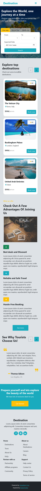
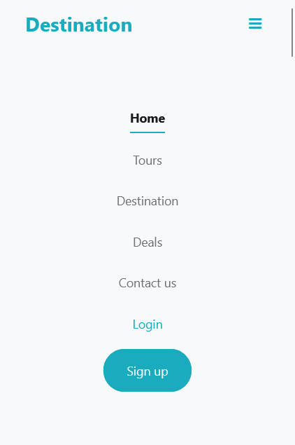
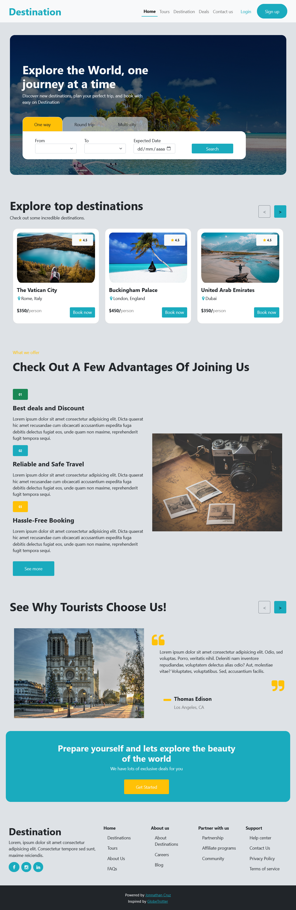
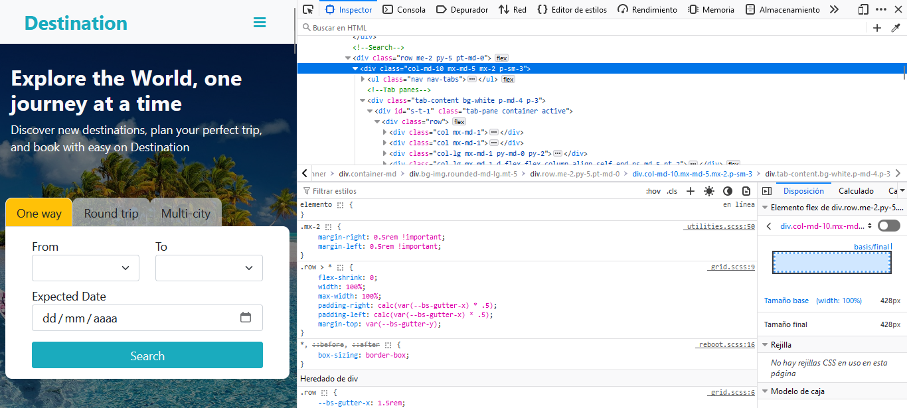

# Destination. Bootstrap

## Descripción

Estudio personal en HTML y hojas de estilo CSS. Busco convertir la investigación en landing pages de sitios ficticios inpirados en el moodboard 'Dev' en mi [ Pinterest](https://pin.it/5y19mMg), el cual alimento y refresco contínuamente. En esta ocasión la exploración corresponde al framework Bootstrap.

Aquí puedes explorar la [Demo funcional](https://jonnathan.site/portfolio/Destination-Bootstrap/index.html).

Y aquí puedes ver [todo mi portafolio!!!](https://jonnathan.site) -> Ready to Roll Out! 

## Instalación

Solo descargar y navegar al index.html de la raíz (no requiere apache). Para realizar cambios en hojas de estilo Sass se debe contar con el entorno de compilación Sass.

## Screenshots

### Mobile:

### Desktop:

## Pruebas

Explora los estilos css en herramientas para desarrollador del navegador, específicamente en la pestaña de 'Editor de estilos' para visualizar los archivos scss. Adicional visualiza las clases utilizadas en cada elemento y como se explota el potencial responsive mobile first.

## Licencia

Este código se distribuye bajo licencia GPLv3.

## Créditos

### Tutoriales:
- https://www.w3schools.com/bootstrap5/
- https://getbootstrap.com/docs/5.3/customize/sass/
- https://booking.webestica.com/index-flight.html

### Inspiración principal:
https://mir-s3-cdn-cf.behance.net/project_modules/max_3840/089818166625295.642161639126d.png

### Assets:
Imagen de <a href="https://pixabay.com/es/users/dariuszsankowski-1441456/?utm_source=link-attribution&utm_medium=referral&utm_campaign=image&utm_content=1130731">Dariusz Sankowski</a> en <a href="https://pixabay.com/es//?utm_source=link-attribution&utm_medium=referral&utm_campaign=image&utm_content=1130731">Pixabay</a>

Imagen de <a href="https://pixabay.com/es/users/leiflinding-4928755/?utm_source=link-attribution&utm_medium=referral&utm_campaign=image&utm_content=3599931">Leif Linding</a> en <a href="https://pixabay.com/es//?utm_source=link-attribution&utm_medium=referral&utm_campaign=image&utm_content=3599931">Pixabay</a>

Imagen de <a href="https://pixabay.com/es/users/julius_silver-4371822/?utm_source=link-attribution&utm_medium=referral&utm_campaign=image&utm_content=3021072">Julius Silver</a> en <a href="https://pixabay.com/es//?utm_source=link-attribution&utm_medium=referral&utm_campaign=image&utm_content=3021072">Pixabay</a>

Imagen de <a href="https://pixabay.com/es/users/asmuse-3280612/?utm_source=link-attribution&utm_medium=referral&utm_campaign=image&utm_content=1749508">畅 苏</a> en <a href="https://pixabay.com/es//?utm_source=link-attribution&utm_medium=referral&utm_campaign=image&utm_content=1749508">Pixabay</a>

Imagen de <a href="https://pixabay.com/es/users/sofcor-6983808/?utm_source=link-attribution&utm_medium=referral&utm_campaign=image&utm_content=2990060">Sofia Cristina Córdova Valladares</a> en <a href="https://pixabay.com/es//?utm_source=link-attribution&utm_medium=referral&utm_campaign=image&utm_content=2990060">Pixabay</a>

